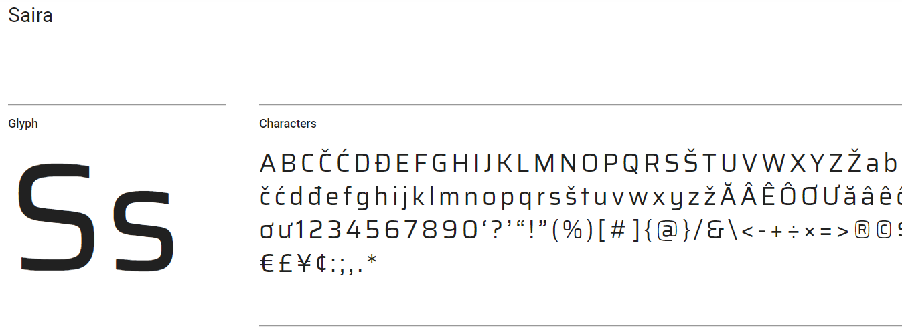

# Saira Typeface

This typeface was designed by Hector Gatti and developed by the Omnibus Type team. To contribute to the project, visit [github.com/Omnibus-Type](http://github.com/Omnibus-Type).



- Online Reference: [google fonts][google-fonts]

[google-fonts]: https://fonts.google.com/specimen/Saira

## Install

```bash
npm install --save @easyfonts/saira-typeface

## or

yarn add @easyfonts/saira-typeface
```

# Example: use all font variants

Trigger your bundler (webpack et al) to include it into your build

```javascript
import '@easfonts/saira-typeface';
```

Above import will include all style and weight variants into your build (1.7Mb), if you want to be more selective try the followig

# Example: use specific font variants

These are a few examples of only selecting specific groups or singualr fontfiles into your build.

For all possible selectible variants view this [table](#overview-of-all-variants);

## Variant Vietnamese

```javascript
import '@easfonts/saira-typeface/saira-vietnamese';
```

Saira font for Vietnamese character set, all font weights from 100 to 900

## Variant Latin

```javascript
import '@easfonts/saira-typeface/saira-latin';
```

Saira font for Latin character set, all font weights from 100 to 900

## Variant Latin Ext

```javascript
import '@easfonts/saira-typeface/saira-latin-ext';
```

Saira font for Latin Extended character set, all font weights from 100 to 900

# Overview of all variants

You get the general idea of selecting perticular set of font files with the `import` command, with import so here is the full table.

| import statement                                                                                                        | what is imported                                 |
| ----------------------------------------------------------------------------------------------------------------------- | ------------------------------------------------ |
| <span style="font-face: monospace;">import '@easyfonts/saira-typeface/css/saira-100-latin-ext';</span>                  | only 100 `font-weight` of latin extended charset |
| <span style="font-face: monospace;">import '@easyfonts/saira-typeface/css/saira-100-latin';</span>                      | only 100 `font-weght` of latin charset           |
| <span style="font-face: monospace;">import '@easyfonts/saira-typeface/css/saira-100-vietnamese';</span>                 | only 100 `font-weght` of vietnamese charset      |
| <span style="font-face: monospace;">import '@easyfonts/saira-typeface/css/saira-100';</span>                            | only 100 `font-weght` of all charsets            |
| <span style="font-face: monospace;">import '@easyfonts/saira-typeface/css/saira-200-latin-ext';</span>                  | only 200 `font-weight` of latin extended charset |
| <span style="font-face: monospace;">import '@easyfonts/saira-typeface/css/saira-200-latin';</span>                      | only 200 `font-weight` of latin charset          |
| <span style="font-face: monospace;">import '@easyfonts/saira-typeface/css/saira-200-vietnamese';</span>                 | only 200 `font-weight` of vietnamese charset     |
| <span style="font-face: monospace;">import '@easyfonts/saira-typeface/css/saira-200';</span>                            | only 200 `font-weight` of all charsets           |
| <span style="font-face: monospace;">import '@easyfonts/saira-typeface/css/saira-300-latin-ext';</span>                  | only 300 `font-weight` of latin extended charset |
| <span style="font-face: monospace;">import '@easyfonts/saira-typeface/css/saira-300-latin';</span>                      | only 300 `font-weight` of latin charset          |
| <span style="font-face: monospace;">import '@easyfonts/saira-typeface/css/saira-300-vietnamese';</span>                 | only 300 `font-weight` of vietnamese charset     |
| <span style="font-face: monospace;">import '@easyfonts/saira-typeface/css/saira-300';</span>                            | only 300 `font-weight` of all charset            |
| <span style="font-face: monospace;">import '@easyfonts/saira-typeface/css/saira-400-latin-ext';</span>                  | only 400 `font-weight` of latin extended charset |
| <span style="font-face: monospace;">import '@easyfonts/saira-typeface/css/saira-400-latin';</span>                      | only 400 `font-weight` of latin charset          |
| <span style="font-face: monospace;">import '@easyfonts/saira-typeface/css/saira-400-vietnamese';</span>                 | only 400 `font-weight` of vietnamese charset     |
| <span style="font-face: monospace;">import '@easyfonts/saira-typeface/css/saira-400';</span>                            | only 400 `font-weight` of all charsets           |
| <span style="font-face: monospace;">import '@easyfonts/saira-typeface/css/saira-500-latin-ext';</span>                  | only 500 `font-weight` of latin extended charset |
| <span style="font-face: monospace;">import '@easyfonts/saira-typeface/css/saira-500-latin';</span>                      | saira-500-latin.css                              |
| <span style="font-face: monospace;">import '@easyfonts/saira-typeface/css/saira-500-vietnamese';</span>                 | saira-500-vietnamese.css                         |
| <span style="font-face: monospace;">import '@easyfonts/saira-typeface/css/saira-500';</span>                            | saira-500.css                                    |
| <span style="font-face: monospace;">import '@easyfonts/saira-typeface/css/saira-600-latin-ext';</span>                  | saira-600-latin-ext.css                          |
| <span style="font-face: monospace;">import '@easyfonts/saira-typeface/css/saira-600-latin';</span>                      | saira-600-latin.css                              |
| <span style="font-face: monospace;">import '@easyfonts/saira-typeface/css/saira-600-vietnamese';</span>                 | saira-600-vietnamese.css                         |
| <span style="font-face: monospace;">import '@easyfonts/saira-typeface/css/saira-600';</span>                            | saira-600.css                                    |
| <span style="font-face: monospace;">import '@easyfonts/saira-typeface/css/saira-700-latin-ext';</span>                  | saira-700-latin-ext.css                          |
| <span style="font-face: monospace;">import '@easyfonts/saira-typeface/css/saira-700-latin';</span>                      | saira-700-latin.css                              |
| <span style="font-face: monospace;">import '@easyfonts/saira-typeface/css/saira-700-vietnamese';</span>                 | saira-700-vietnamese.css                         |
| <span style="font-face: monospace;">import '@easyfonts/saira-typeface/css/saira-700';</span>                            | saira-700.css                                    |
| <span style="font-face: monospace;">import '@easyfonts/saira-typeface/css/saira-800-latin-ext';</span>                  | saira-800-latin-ext.css                          |
| <span style="font-face: monospace;">import '@easyfonts/saira-typeface/css/saira-800-latin';</span>                      | saira-800-latin.css                              |
| <span style="font-face: monospace;">import '@easyfonts/saira-typeface/css/saira-800-vietnamese';</span>                 | saira-800-vietnamese.css                         |
| <span style="font-face: monospace;">import '@easyfonts/saira-typeface/css/saira-800';</span>                            | saira-800.css                                    |
| <span style="font-face: monospace;">import '@easyfonts/saira-typeface/css/saira-900-latin-ext';</span>                  | saira-900-latin-ext.css                          |
| <span style="font-face: monospace;">import '@easyfonts/saira-typeface/css/saira-900-latin';</span>                      | saira-900-latin.css                              |
| <span style="font-face: monospace;">import '@easyfonts/saira-typeface/css/saira-900-vietnamese';</span>                 | saira-900-vietnamese.css                         |
| <span style="font-face: monospace;">import '@easyfonts/saira-typeface/css/saira-900';</span>                            | saira-900.css                                    |
| <span style="font-face: monospace;">import '@easyfonts/saira-typeface/css/saira-condensed-100-latin-ext';</span>        | saira-condensed-100-latin-ext.css                |
| <span style="font-face: monospace;">import '@easyfonts/saira-typeface/css/saira-condensed-100-latin';</span>            | saira-condensed-100-latin.css                    |
| <span style="font-face: monospace;">import '@easyfonts/saira-typeface/css/saira-condensed-100-vietnamese';</span>       | saira-condensed-100-vietnamese.css               |
| <span style="font-face: monospace;">import '@easyfonts/saira-typeface/css/saira-condensed-100';</span>                  | saira-condensed-100.css                          |
| <span style="font-face: monospace;">import '@easyfonts/saira-typeface/css/saira-condensed-200-latin-ext';</span>        | saira-condensed-200-latin-ext.css                |
| <span style="font-face: monospace;">import '@easyfonts/saira-typeface/css/saira-condensed-200-latin';</span>            | saira-condensed-200-latin.css                    |
| <span style="font-face: monospace;">import '@easyfonts/saira-typeface/css/saira-condensed-200-vietnamese';</span>       | saira-condensed-200-vietnamese.css               |
| <span style="font-face: monospace;">import '@easyfonts/saira-typeface/css/saira-condensed-200';</span>                  | saira-condensed-200.css                          |
| <span style="font-face: monospace;">import '@easyfonts/saira-typeface/css/saira-condensed-300-latin-ext';</span>        | saira-condensed-300-latin-ext.css                |
| <span style="font-face: monospace;">import '@easyfonts/saira-typeface/css/saira-condensed-300-latin';</span>            | saira-condensed-300-latin.css                    |
| <span style="font-face: monospace;">import '@easyfonts/saira-typeface/css/saira-condensed-300-vietnamese';</span>       | saira-condensed-300-vietnamese.css               |
| <span style="font-face: monospace;">import '@easyfonts/saira-typeface/css/saira-condensed-300';</span>                  | saira-condensed-300.css                          |
| <span style="font-face: monospace;">import '@easyfonts/saira-typeface/css/saira-condensed-400-latin-ext';</span>        | saira-condensed-400-latin-ext.css                |
| <span style="font-face: monospace;">import '@easyfonts/saira-typeface/css/saira-condensed-400-latin';</span>            | saira-condensed-400-latin.css                    |
| <span style="font-face: monospace;">import '@easyfonts/saira-typeface/css/saira-condensed-400-vietnamese';</span>       | saira-condensed-400-vietnamese.css               |
| <span style="font-face: monospace;">import '@easyfonts/saira-typeface/css/saira-condensed-400';</span>                  | saira-condensed-400.css                          |
| <span style="font-face: monospace;">import '@easyfonts/saira-typeface/css/saira-condensed-500-latin-ext';</span>        | saira-condensed-500-latin-ext.css                |
| <span style="font-face: monospace;">import '@easyfonts/saira-typeface/css/saira-condensed-500-latin';</span>            | saira-condensed-500-latin.css                    |
| <span style="font-face: monospace;">import '@easyfonts/saira-typeface/css/saira-condensed-500-vietnamese';</span>       | saira-condensed-500-vietnamese.css               |
| <span style="font-face: monospace;">import '@easyfonts/saira-typeface/css/saira-condensed-500';</span>                  | saira-condensed-500.css                          |
| <span style="font-face: monospace;">import '@easyfonts/saira-typeface/css/saira-condensed-600-latin-ext';</span>        | saira-condensed-600-latin-ext.css                |
| <span style="font-face: monospace;">import '@easyfonts/saira-typeface/css/saira-condensed-600-latin';</span>            | saira-condensed-600-latin.css                    |
| <span style="font-face: monospace;">import '@easyfonts/saira-typeface/css/saira-condensed-600-vietnamese';</span>       | saira-condensed-600-vietnamese.css               |
| <span style="font-face: monospace;">import '@easyfonts/saira-typeface/css/saira-condensed-600';</span>                  | saira-condensed-600.css                          |
| <span style="font-face: monospace;">import '@easyfonts/saira-typeface/css/saira-condensed-700-latin-ext';</span>        | saira-condensed-700-latin-ext.css                |
| <span style="font-face: monospace;">import '@easyfonts/saira-typeface/css/saira-condensed-700-latin';</span>            | saira-condensed-700-latin.css                    |
| <span style="font-face: monospace;">import '@easyfonts/saira-typeface/css/saira-condensed-700-vietnamese';</span>       | saira-condensed-700-vietnamese.css               |
| <span style="font-face: monospace;">import '@easyfonts/saira-typeface/css/saira-condensed-700';</span>                  | saira-condensed-700.css                          |
| <span style="font-face: monospace;">import '@easyfonts/saira-typeface/css/saira-condensed-800-latin-ext';</span>        | saira-condensed-800-latin-ext.css                |
| <span style="font-face: monospace;">import '@easyfonts/saira-typeface/css/saira-condensed-800-latin';</span>            | saira-condensed-800-latin.css                    |
| <span style="font-face: monospace;">import '@easyfonts/saira-typeface/css/saira-condensed-800-vietnamese';</span>       | saira-condensed-800-vietnamese.css               |
| <span style="font-face: monospace;">import '@easyfonts/saira-typeface/css/saira-condensed-800';</span>                  | saira-condensed-800.css                          |
| <span style="font-face: monospace;">import '@easyfonts/saira-typeface/css/saira-condensed-900-latin-ext';</span>        | saira-condensed-900-latin-ext.css                |
| <span style="font-face: monospace;">import '@easyfonts/saira-typeface/css/saira-condensed-900-latin';</span>            | saira-condensed-900-latin.css                    |
| <span style="font-face: monospace;">import '@easyfonts/saira-typeface/css/saira-condensed-900-vietnamese';</span>       | saira-condensed-900-vietnamese.css               |
| <span style="font-face: monospace;">import '@easyfonts/saira-typeface/css/saira-condensed-900';</span>                  | saira-condensed-900.css                          |
| <span style="font-face: monospace;">import '@easyfonts/saira-typeface/css/saira-condensed-latin-ext';</span>            | saira-condensed-latin-ext.css                    |
| <span style="font-face: monospace;">import '@easyfonts/saira-typeface/css/saira-condensed-latin';</span>                | saira-condensed-latin.css                        |
| <span style="font-face: monospace;">import '@easyfonts/saira-typeface/css/saira-condensed-vietnamese';</span>           | saira-condensed-vietnamese.css                   |
| <span style="font-face: monospace;">import '@easyfonts/saira-typeface/css/saira-condensed';</span>                      | saira-condensed.css                              |
| <span style="font-face: monospace;">import '@easyfonts/saira-typeface/css/saira-extra-condensed-100-latin-ext';</span>  | saira-extra-condensed-100-latin-ext.css          |
| <span style="font-face: monospace;">import '@easyfonts/saira-typeface/css/saira-extra-condensed-100-latin';</span>      | saira-extra-condensed-100-latin.css              |
| <span style="font-face: monospace;">import '@easyfonts/saira-typeface/css/saira-extra-condensed-100-vietnamese';</span> | saira-extra-condensed-100-vietnamese.css         |
| <span style="font-face: monospace;">import '@easyfonts/saira-typeface/css/saira-extra-condensed-100';</span>            | saira-extra-condensed-100.css                    |
| <span style="font-face: monospace;">import '@easyfonts/saira-typeface/css/saira-extra-condensed-200-latin-ext';</span>  | saira-extra-condensed-200-latin-ext.css          |
| <span style="font-face: monospace;">import '@easyfonts/saira-typeface/css/saira-extra-condensed-200-latin';</span>      | saira-extra-condensed-200-latin.css              |
| <span style="font-face: monospace;">import '@easyfonts/saira-typeface/css/saira-extra-condensed-200-vietnamese';</span> | saira-extra-condensed-200-vietnamese.css         |
| <span style="font-face: monospace;">import '@easyfonts/saira-typeface/css/saira-extra-condensed-200';</span>            | saira-extra-condensed-200.css                    |
| <span style="font-face: monospace;">import '@easyfonts/saira-typeface/css/saira-extra-condensed-300-latin-ext';</span>  | saira-extra-condensed-300-latin-ext.css          |
| <span style="font-face: monospace;">import '@easyfonts/saira-typeface/css/saira-extra-condensed-300-latin';</span>      | saira-extra-condensed-300-latin.css              |
| <span style="font-face: monospace;">import '@easyfonts/saira-typeface/css/saira-extra-condensed-300-vietnamese';</span> | saira-extra-condensed-300-vietnamese.css         |
| <span style="font-face: monospace;">import '@easyfonts/saira-typeface/css/saira-extra-condensed-300';</span>            | saira-extra-condensed-300.css                    |
| <span style="font-face: monospace;">import '@easyfonts/saira-typeface/css/saira-extra-condensed-400-latin-ext';</span>  | saira-extra-condensed-400-latin-ext.css          |
| <span style="font-face: monospace;">import '@easyfonts/saira-typeface/css/saira-extra-condensed-400-latin';</span>      | saira-extra-condensed-400-latin.css              |
| <span style="font-face: monospace;">import '@easyfonts/saira-typeface/css/saira-extra-condensed-400-vietnamese';</span> | saira-extra-condensed-400-vietnamese.css         |
| <span style="font-face: monospace;">import '@easyfonts/saira-typeface/css/saira-extra-condensed-400';</span>            | saira-extra-condensed-400.css                    |
| <span style="font-face: monospace;">import '@easyfonts/saira-typeface/css/saira-extra-condensed-500-latin-ext';</span>  | saira-extra-condensed-500-latin-ext.css          |
| <span style="font-face: monospace;">import '@easyfonts/saira-typeface/css/saira-extra-condensed-500-latin';</span>      | saira-extra-condensed-500-latin.css              |
| <span style="font-face: monospace;">import '@easyfonts/saira-typeface/css/saira-extra-condensed-500-vietnamese';</span> | saira-extra-condensed-500-vietnamese.css         |
| <span style="font-face: monospace;">import '@easyfonts/saira-typeface/css/saira-extra-condensed-500';</span>            | saira-extra-condensed-500.css                    |
| <span style="font-face: monospace;">import '@easyfonts/saira-typeface/css/saira-extra-condensed-600-latin-ext';</span>  | saira-extra-condensed-600-latin-ext.css          |
| <span style="font-face: monospace;">import '@easyfonts/saira-typeface/css/saira-extra-condensed-600-latin';</span>      | saira-extra-condensed-600-latin.css              |
| <span style="font-face: monospace;">import '@easyfonts/saira-typeface/css/saira-extra-condensed-600-vietnamese';</span> | saira-extra-condensed-600-vietnamese.css         |
| <span style="font-face: monospace;">import '@easyfonts/saira-typeface/css/saira-extra-condensed-600';</span>            | saira-extra-condensed-600.css                    |
| <span style="font-face: monospace;">import '@easyfonts/saira-typeface/css/saira-extra-condensed-700-latin-ext';</span>  | saira-extra-condensed-700-latin-ext.css          |
| <span style="font-face: monospace;">import '@easyfonts/saira-typeface/css/saira-extra-condensed-700-latin';</span>      | saira-extra-condensed-700-latin.css              |
| <span style="font-face: monospace;">import '@easyfonts/saira-typeface/css/saira-extra-condensed-700-vietnamese';</span> | saira-extra-condensed-700-vietnamese.css         |
| <span style="font-face: monospace;">import '@easyfonts/saira-typeface/css/saira-extra-condensed-700';</span>            | saira-extra-condensed-700.css                    |
| <span style="font-face: monospace;">import '@easyfonts/saira-typeface/css/saira-extra-condensed-800-latin-ext';</span>  | saira-extra-condensed-800-latin-ext.css          |
| <span style="font-face: monospace;">import '@easyfonts/saira-typeface/css/saira-extra-condensed-800-latin';</span>      | saira-extra-condensed-800-latin.css              |
| <span style="font-face: monospace;">import '@easyfonts/saira-typeface/css/saira-extra-condensed-800-vietnamese';</span> | saira-extra-condensed-800-vietnamese.css         |
| <span style="font-face: monospace;">import '@easyfonts/saira-typeface/css/saira-extra-condensed-800';</span>            | saira-extra-condensed-800.css                    |
| <span style="font-face: monospace;">import '@easyfonts/saira-typeface/css/saira-extra-condensed-900-latin-ext';</span>  | saira-extra-condensed-900-latin-ext.css          |
| <span style="font-face: monospace;">import '@easyfonts/saira-typeface/css/saira-extra-condensed-900-latin';</span>      | saira-extra-condensed-900-latin.css              |
| <span style="font-face: monospace;">import '@easyfonts/saira-typeface/css/saira-extra-condensed-900-vietnamese';</span> | saira-extra-condensed-900-vietnamese.css         |
| <span style="font-face: monospace;">import '@easyfonts/saira-typeface/css/saira-extra-condensed-900';</span>            | saira-extra-condensed-900.css                    |
| <span style="font-face: monospace;">import '@easyfonts/saira-typeface/css/saira-extra-condensed-latin-ext';</span>      | saira-extra-condensed-latin-ext.css              |
| <span style="font-face: monospace;">import '@easyfonts/saira-typeface/css/saira-extra-condensed-latin';</span>          | saira-extra-condensed-latin.css                  |
| <span style="font-face: monospace;">import '@easyfonts/saira-typeface/css/saira-extra-condensed-vietnamese';</span>     | saira-extra-condensed-vietnamese.css             |
| <span style="font-face: monospace;">import '@easyfonts/saira-typeface/css/saira-extra-condensed';</span>                | saira-extra-condensed.css                        |
| <span style="font-face: monospace;">import '@easyfonts/saira-typeface/css/saira-latin-ext';</span>                      | saira-latin-ext.css                              |
| <span style="font-face: monospace;">import '@easyfonts/saira-typeface/css/saira-latin';</span>                          | saira-latin.css                                  |
| <span style="font-face: monospace;">import '@easyfonts/saira-typeface/css/saira-semi-condensed-100-latin-ext';</span>   | saira-semi-condensed-100-latin-ext.css           |
| <span style="font-face: monospace;">import '@easyfonts/saira-typeface/css/saira-semi-condensed-100-latin';</span>       | saira-semi-condensed-100-latin.css               |
| <span style="font-face: monospace;">import '@easyfonts/saira-typeface/css/saira-semi-condensed-100-vietnamese';</span>  | saira-semi-condensed-100-vietnamese.css          |
| <span style="font-face: monospace;">import '@easyfonts/saira-typeface/css/saira-semi-condensed-100';</span>             | saira-semi-condensed-100.css                     |
| <span style="font-face: monospace;">import '@easyfonts/saira-typeface/css/saira-semi-condensed-200-latin-ext';</span>   | saira-semi-condensed-200-latin-ext.css           |
| <span style="font-face: monospace;">import '@easyfonts/saira-typeface/css/saira-semi-condensed-200-latin';</span>       | saira-semi-condensed-200-latin.css               |
| <span style="font-face: monospace;">import '@easyfonts/saira-typeface/css/saira-semi-condensed-200-vietnamese';</span>  | saira-semi-condensed-200-vietnamese.css          |
| <span style="font-face: monospace;">import '@easyfonts/saira-typeface/css/saira-semi-condensed-200';</span>             | saira-semi-condensed-200.css                     |
| <span style="font-face: monospace;">import '@easyfonts/saira-typeface/css/saira-semi-condensed-300-latin-ext';</span>   | saira-semi-condensed-300-latin-ext.css           |
| <span style="font-face: monospace;">import '@easyfonts/saira-typeface/css/saira-semi-condensed-300-latin';</span>       | saira-semi-condensed-300-latin.css               |
| <span style="font-face: monospace;">import '@easyfonts/saira-typeface/css/saira-semi-condensed-300-vietnamese';</span>  | saira-semi-condensed-300-vietnamese.css          |
| <span style="font-face: monospace;">import '@easyfonts/saira-typeface/css/saira-semi-condensed-300';</span>             | saira-semi-condensed-300.css                     |
| <span style="font-face: monospace;">import '@easyfonts/saira-typeface/css/saira-semi-condensed-400-latin-ext';</span>   | saira-semi-condensed-400-latin-ext.css           |
| <span style="font-face: monospace;">import '@easyfonts/saira-typeface/css/saira-semi-condensed-400-latin';</span>       | saira-semi-condensed-400-latin.css               |
| <span style="font-face: monospace;">import '@easyfonts/saira-typeface/css/saira-semi-condensed-400-vietnamese';</span>  | saira-semi-condensed-400-vietnamese.css          |
| <span style="font-face: monospace;">import '@easyfonts/saira-typeface/css/saira-semi-condensed-400';</span>             | saira-semi-condensed-400.css                     |
| <span style="font-face: monospace;">import '@easyfonts/saira-typeface/css/saira-semi-condensed-500-latin-ext';</span>   | saira-semi-condensed-500-latin-ext.css           |
| <span style="font-face: monospace;">import '@easyfonts/saira-typeface/css/saira-semi-condensed-500-latin';</span>       | saira-semi-condensed-500-latin.css               |
| <span style="font-face: monospace;">import '@easyfonts/saira-typeface/css/saira-semi-condensed-500-vietnamese';</span>  | saira-semi-condensed-500-vietnamese.css          |
| <span style="font-face: monospace;">import '@easyfonts/saira-typeface/css/saira-semi-condensed-500';</span>             | saira-semi-condensed-500.css                     |
| <span style="font-face: monospace;">import '@easyfonts/saira-typeface/css/saira-semi-condensed-600-latin-ext';</span>   | saira-semi-condensed-600-latin-ext.css           |
| <span style="font-face: monospace;">import '@easyfonts/saira-typeface/css/saira-semi-condensed-600-latin';</span>       | saira-semi-condensed-600-latin.css               |
| <span style="font-face: monospace;">import '@easyfonts/saira-typeface/css/saira-semi-condensed-600-vietnamese';</span>  | saira-semi-condensed-600-vietnamese.css          |
| <span style="font-face: monospace;">import '@easyfonts/saira-typeface/css/saira-semi-condensed-600';</span>             | saira-semi-condensed-600.css                     |
| <span style="font-face: monospace;">import '@easyfonts/saira-typeface/css/saira-semi-condensed-700-latin-ext';</span>   | saira-semi-condensed-700-latin-ext.css           |
| <span style="font-face: monospace;">import '@easyfonts/saira-typeface/css/saira-semi-condensed-700-latin';</span>       | saira-semi-condensed-700-latin.css               |
| <span style="font-face: monospace;">import '@easyfonts/saira-typeface/css/saira-semi-condensed-700-vietnamese';</span>  | saira-semi-condensed-700-vietnamese.css          |
| <span style="font-face: monospace;">import '@easyfonts/saira-typeface/css/saira-semi-condensed-700';</span>             | saira-semi-condensed-700.css                     |
| <span style="font-face: monospace;">import '@easyfonts/saira-typeface/css/saira-semi-condensed-800-latin-ext';</span>   | saira-semi-condensed-800-latin-ext.css           |
| <span style="font-face: monospace;">import '@easyfonts/saira-typeface/css/saira-semi-condensed-800-latin';</span>       | saira-semi-condensed-800-latin.css               |
| <span style="font-face: monospace;">import '@easyfonts/saira-typeface/css/saira-semi-condensed-800-vietnamese';</span>  | saira-semi-condensed-800-vietnamese.css          |
| <span style="font-face: monospace;">import '@easyfonts/saira-typeface/css/saira-semi-condensed-800';</span>             | saira-semi-condensed-800.css                     |
| <span style="font-face: monospace;">import '@easyfonts/saira-typeface/css/saira-semi-condensed-900-latin-ext';</span>   | saira-semi-condensed-900-latin-ext.css           |
| <span style="font-face: monospace;">import '@easyfonts/saira-typeface/css/saira-semi-condensed-900-latin';</span>       | saira-semi-condensed-900-latin.css               |
| <span style="font-face: monospace;">import '@easyfonts/saira-typeface/css/saira-semi-condensed-900-vietnamese';</span>  | saira-semi-condensed-900-vietnamese.css          |
| <span style="font-face: monospace;">import '@easyfonts/saira-typeface/css/saira-semi-condensed-900';</span>             | saira-semi-condensed-900.css                     |
| <span style="font-face: monospace;">import '@easyfonts/saira-typeface/css/saira-semi-condensed-latin-ext';</span>       | saira-semi-condensed-latin-ext.css               |
| <span style="font-face: monospace;">import '@easyfonts/saira-typeface/css/saira-semi-condensed-latin';</span>           | saira-semi-condensed-latin.css                   |
| <span style="font-face: monospace;">import '@easyfonts/saira-typeface/css/saira-semi-condensed-vietnamese';</span>      | saira-semi-condensed-vietnamese.css              |
| <span style="font-face: monospace;">import '@easyfonts/saira-typeface/css/saira-semi-condensed';</span>                 | saira-semi-condensed.css                         |
| <span style="font-face: monospace;">import '@easyfonts/saira-typeface/css/saira-vietnamese';</span>                     | saira-vietnamese.css                             |
| <span style="font-face: monospace;">import '@easyfonts/saira-typeface/css/saira';</span>                                | saira.css                                        |
